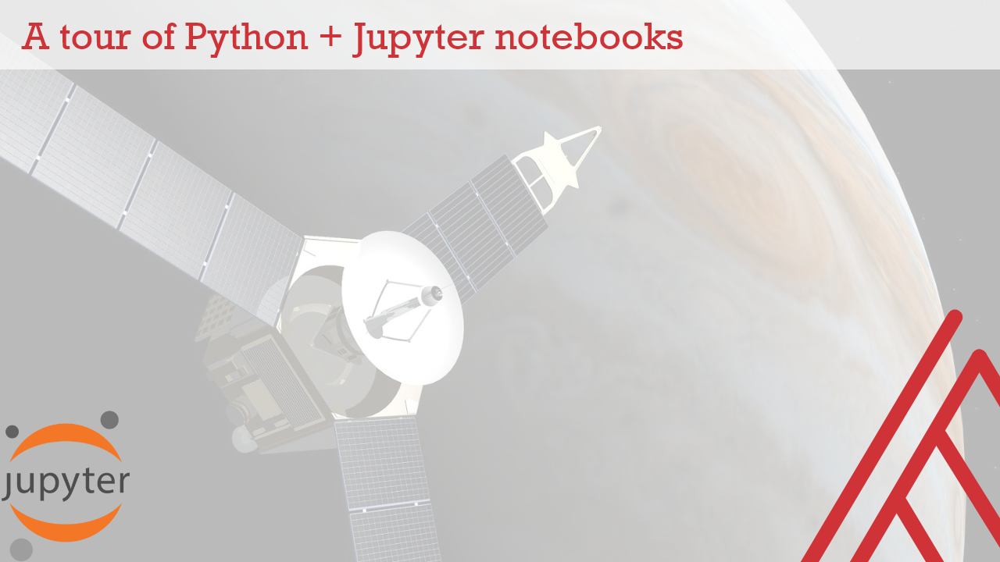

# A tour of Python + Jupyter Notebooks

Resources to accompany [blog post on stringfestanalytics.com](https://georgejmount.com/?p=7310)

Click the button below to launch Jupyter.

To learn how to run Python and Jupyter locally on your computer, check out the below book. 

## Want more Python? Check out my book, [_Advancing into Analytics: From Excel to Python and R_](http://georgejmount.com/book/).

